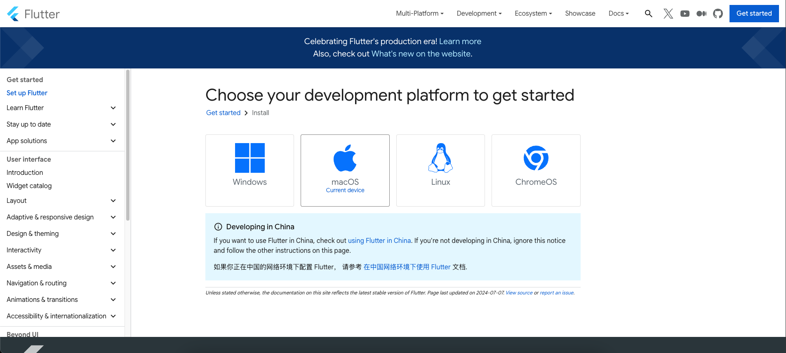
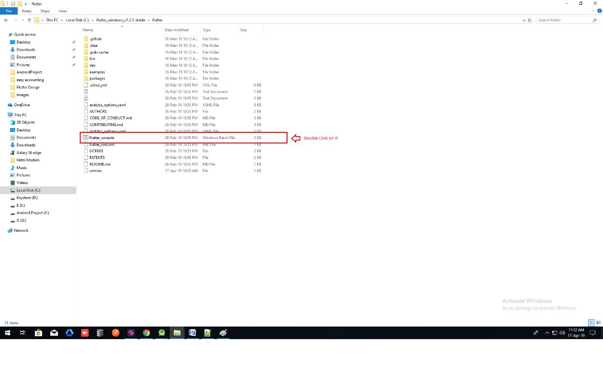
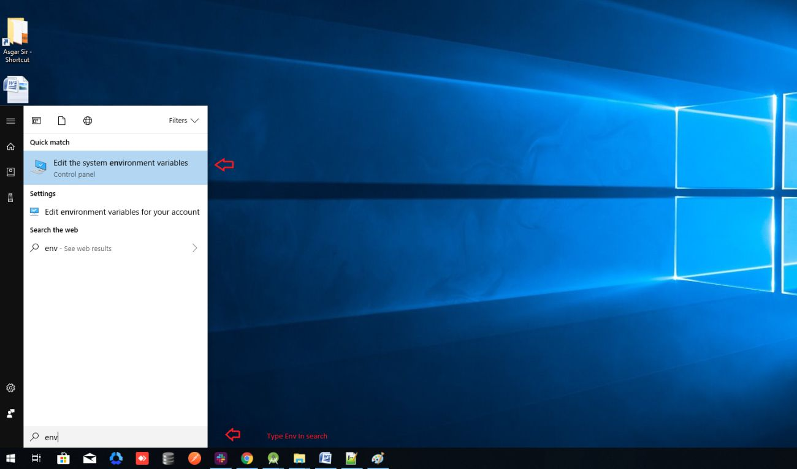
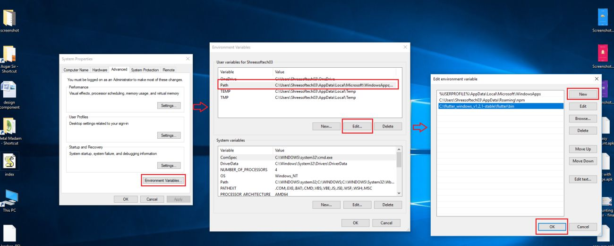
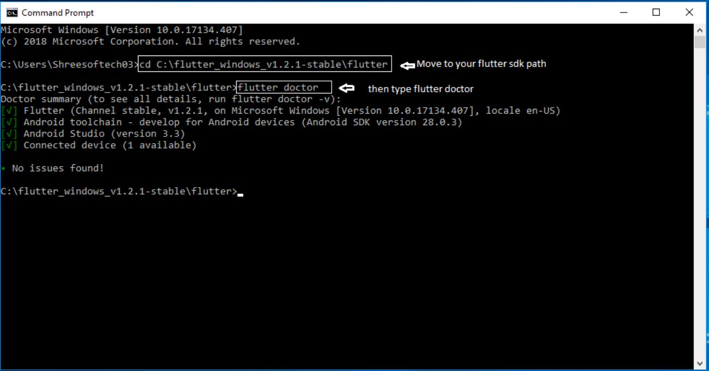
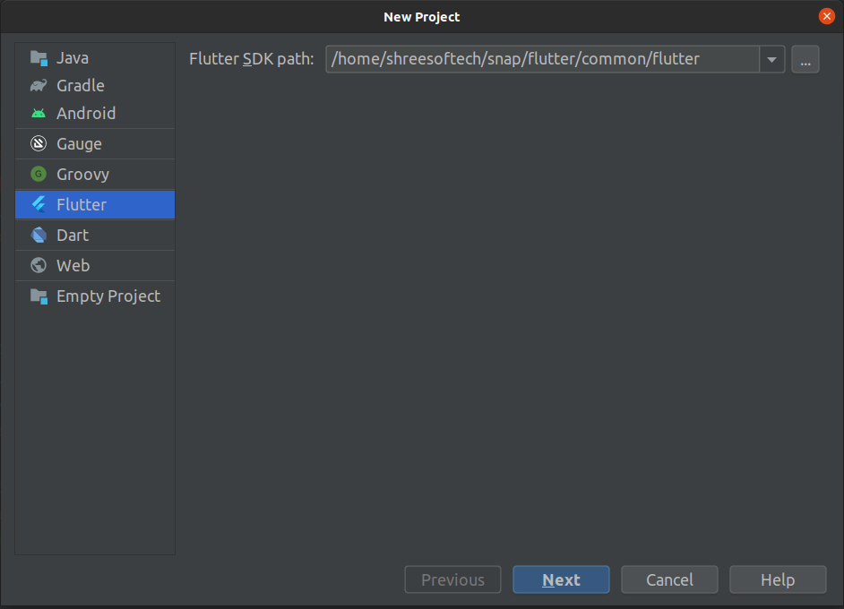

# How to setup Flutter

1. Download the latest Flutter SDK from the link below. Click the `flutter_windows_xxx.zip` button.
   [Flutter SDK](https://flutter.dev/docs/get-started/install/windows)

   

2. Extract the zip file and copy the `flutter` folder to your desired installation location for the Flutter SDK (e.g. `C:\src\flutter`). Do **not** install Flutter in a directory like `C:\Program Files\`.

3. Inside the Flutter folder, find `flutter_console.bat` and start it by double-clicking it.

   

4. Now set your environment variable.

5. From the Start search bar, type `env` and select **Edit environment variables for your account**.

   

6. Under **User variables**, check if there is an entry called `Path`.

7. Click **Edit** → **New**, and paste the full path to `flutter\bin` as its value.

   

8. Restart your PC for the changes to take effect.

9. Verify everything is set up correctly. Open `cmd` and run the command shown below.

   

10. Open Android Studio, create a new Flutter project, and point it to the Flutter SDK location you downloaded earlier.

    
