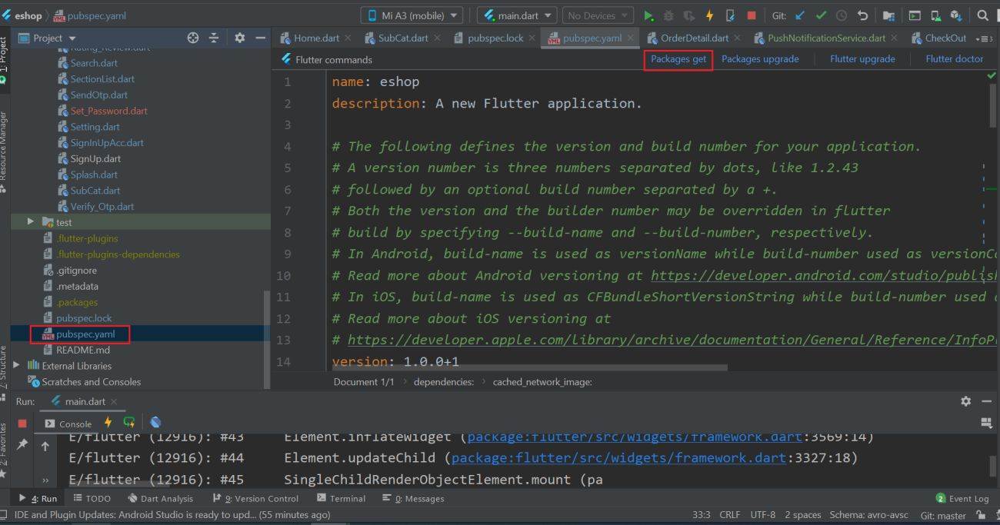
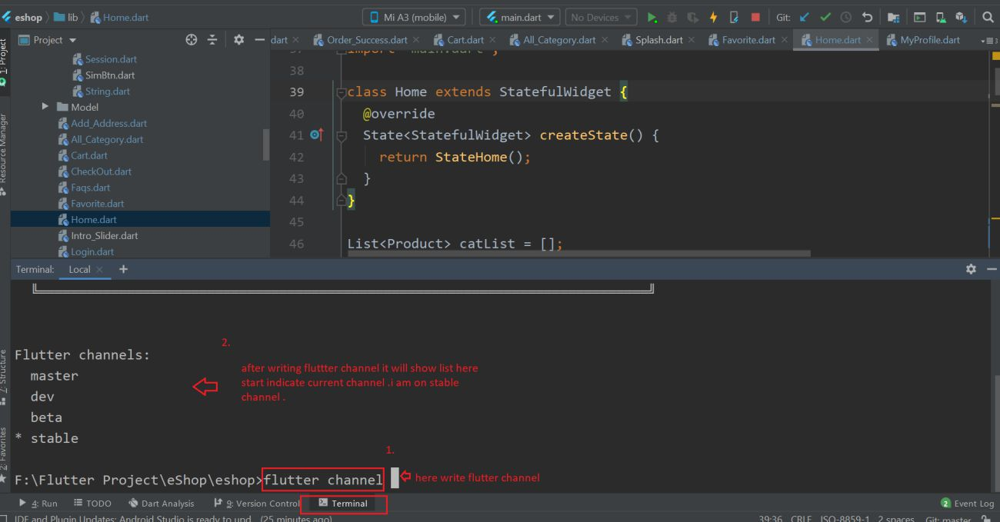

# How to run the Flutter project

1. Go to **File → Open**, then choose your downloaded project location — your project will open. If you see **Enable dart support** in the upper-right, click it, then open `pubspec.yaml` and click **Pub get** (or **Packages get**) in the upper-right, then press **Run**.

2. **If you get an error**, try the following:
   - If your system firewall is on, temporarily disable it and try running the project again.
   - If your Flutter channel is not `stable`, switch to it. Check your current channel from the terminal.
   - Open the terminal at the bottom of Android Studio and run `flutter channel`, as shown below.

     

   - If you're not on `stable`, run `flutter channel stable`.
   - Go to **Tools → Flutter → Flutter Clean**.
   - Go to **File → Invalidate Caches / Restart**.
