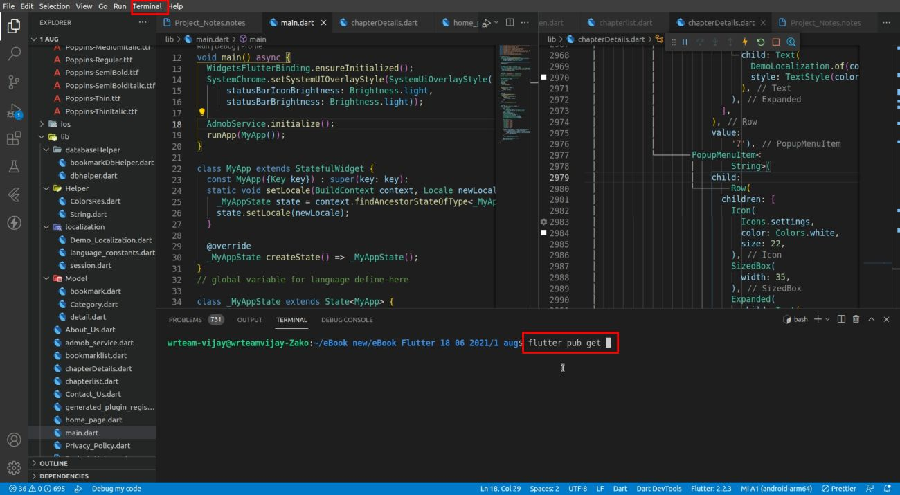

# How to run Flutter in VS Code

1. Visual Studio Code is a lightweight but powerful source code editor (optional — all the Android Studio setup steps above are still required).
2. To download VS Code, [click here](https://code.visualstudio.com/Download).
3. Open VS Code, go to the terminal option, and open a terminal.

   

4. Inside the terminal, run the app with these two commands:
   1. `flutter pub get` (or `flutter packages get`)
   2. `flutter run`
