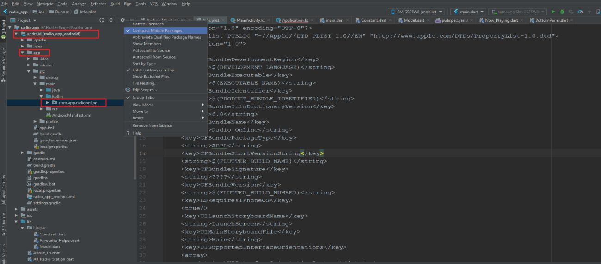
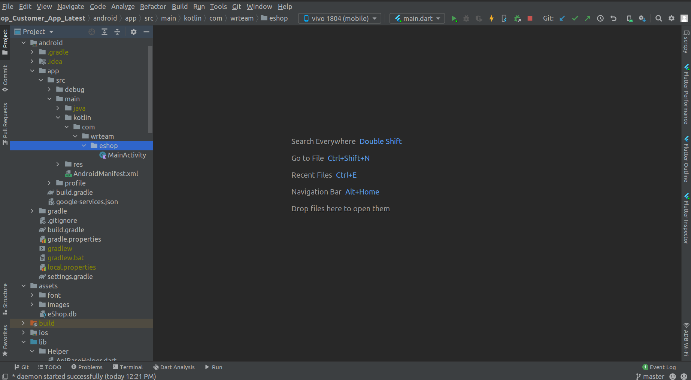
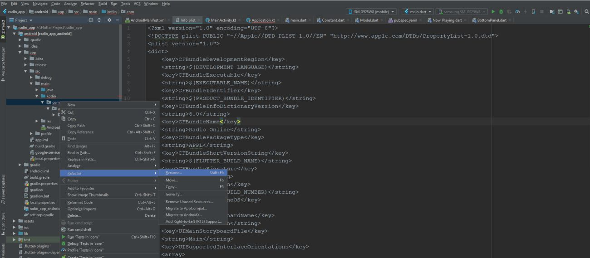
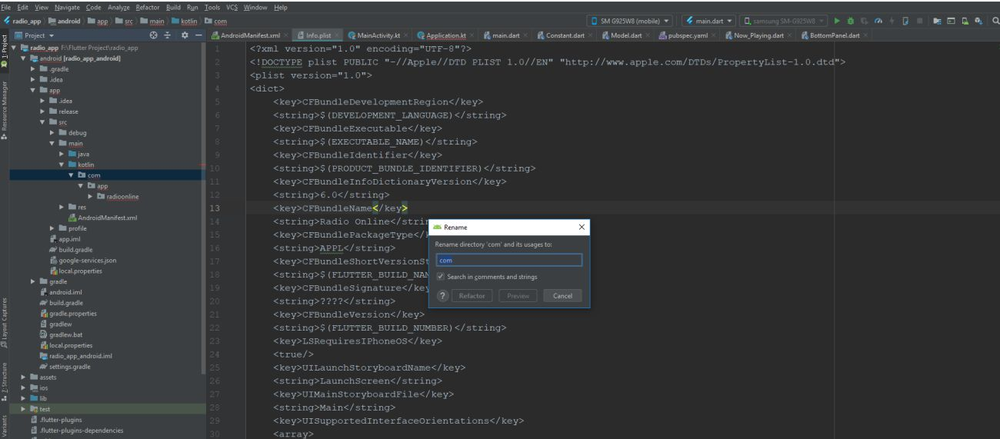
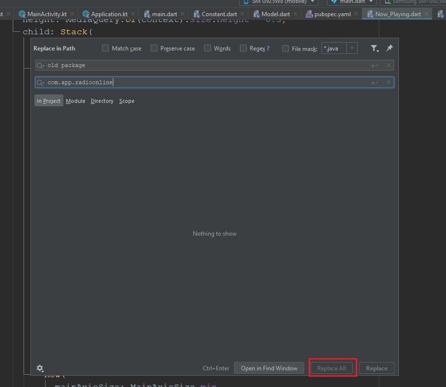
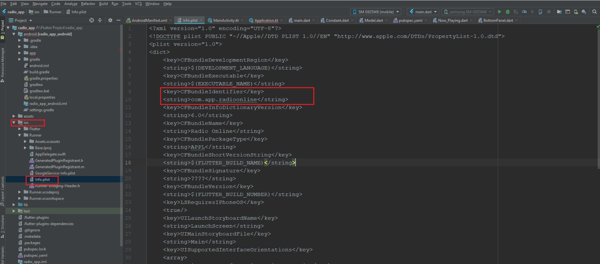
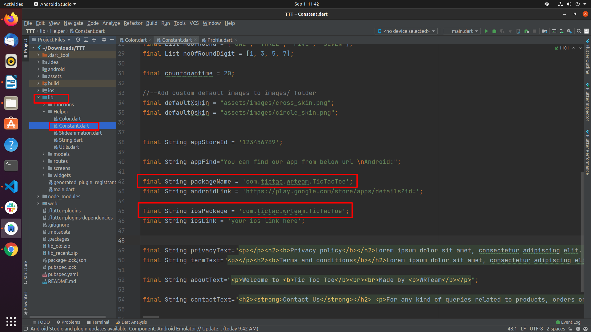
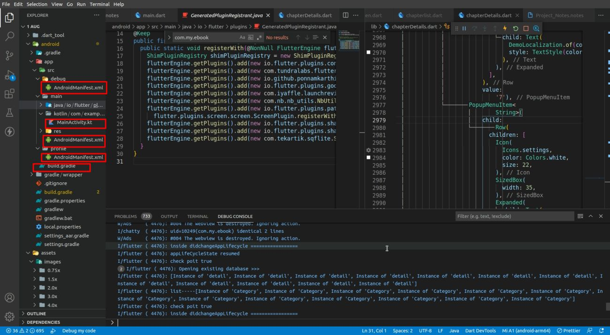

# How to change the package name

## Android

1. In the Android panel, click the gear icon and uncheck **Compact Empty Middle Packages**.

   

2. Your package directory will now be broken up into individual directories.

   

3. Select each directory you want to rename: right-click it → **Refactor** → **Rename**.

   

4. Enter the new name and hit **Refactor**. Give Android Studio a minute to update everything.

   

5. Press `Ctrl+Shift+R` and replace the old package name with your new one everywhere it still appears (`build.gradle`, `AndroidManifest.xml`, etc.).

   

> **Tip:** you can also use the [`change_app_package_name`](https://pub.dev/packages/change_app_package_name) pub package to rename the Android/iOS package name in one command instead of doing it manually.

## iOS

Open `ios/Runner/Info.plist`, find the `CFBundleIdentifier` key, and change its string value as shown below.

## VS Code

If you're using VS Code, press `Ctrl+F` (project-wide search) for the old package name in the files shown below and replace it with your new package name.

