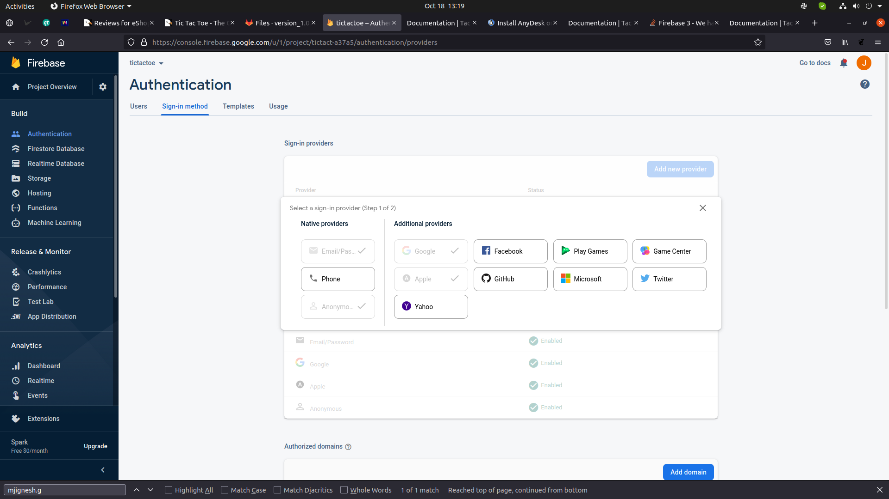

# How to enable Firebase Authentication

1. Open your Firebase project → **Build → Authentication → Get started → Sign-in method**. Enable all the sign-in providers you want to use, as shown below.

   

2. If you're using **Google Sign-In**, you also need to enable the required OAuth APIs:
   - Go to the [Google Cloud Console](https://console.developers.google.com/) for the same project.
   - Enable the **People API**.
   - Under **APIs & Services → OAuth consent screen**, make sure all required fields are filled in.

   Skipping this step commonly causes `ApiException` / `PlatformException` errors at sign-in time.

3. Make sure your Android app's SHA-1 fingerprint is registered in **Project settings → Your apps** (see [Firebase integration](02-firebase-integration.md)) — Google Sign-In won't work on Android without it.
