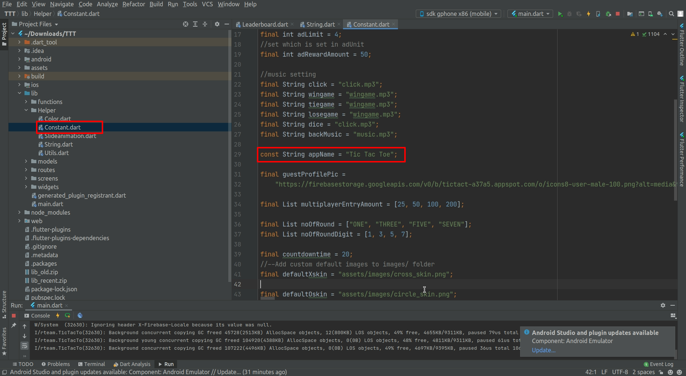
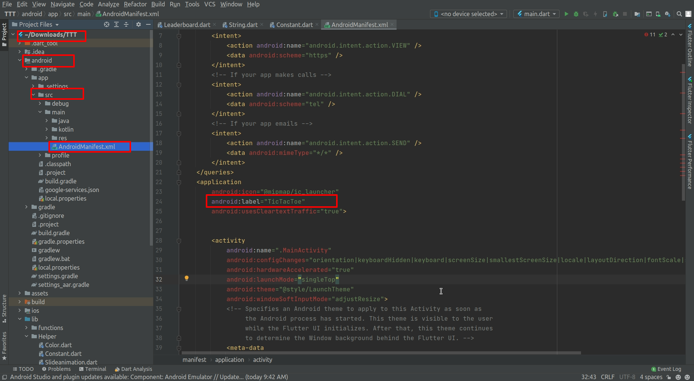

# How to change the application name

## Android

Go to `android/app/src/main/AndroidManifest.xml` and change the `android:label` value.

## iOS

Go to `ios/Runner/Info.plist` and change the `CFBundleName` / `CFBundleDisplayName` value.

