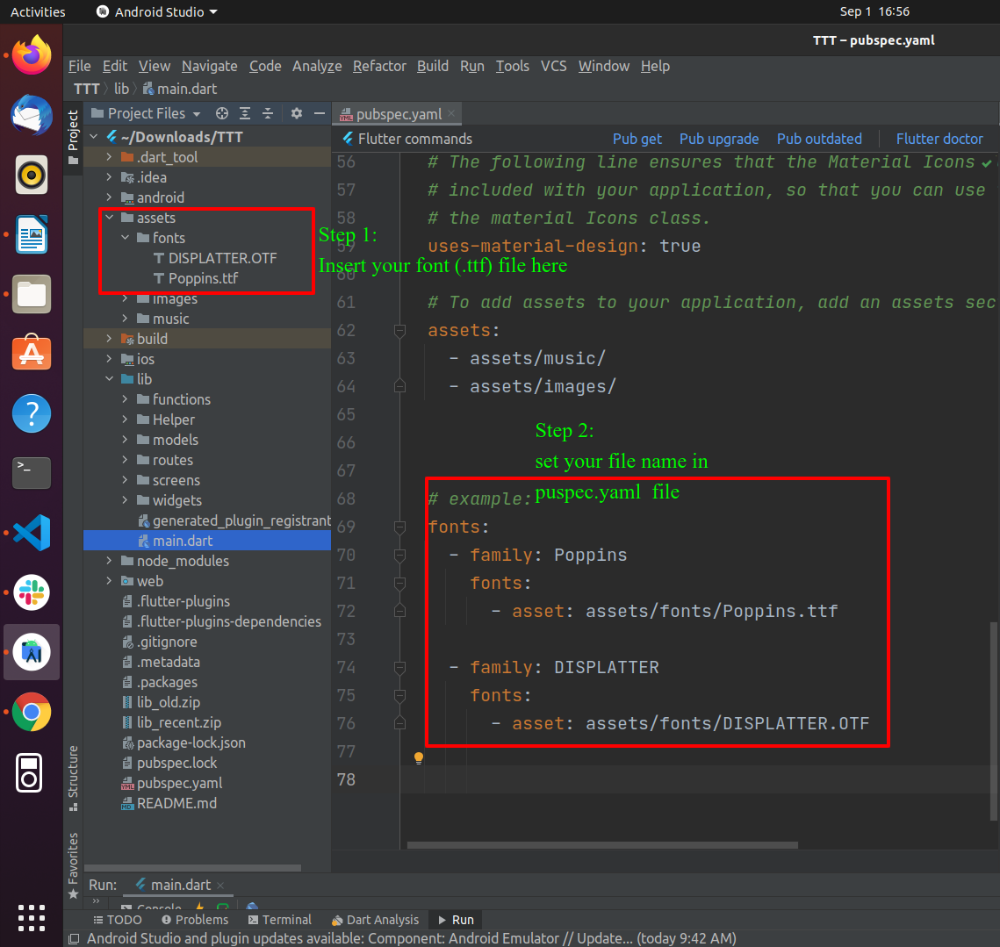
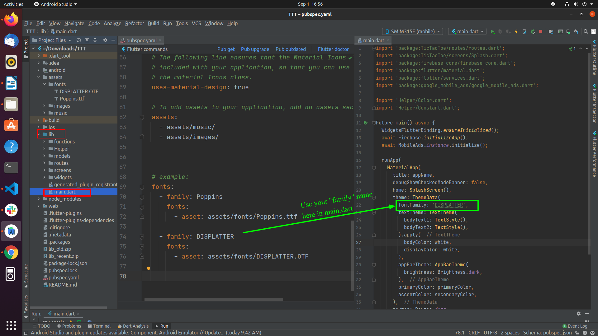

# How to change the application font

1. Add your font file under `assets/fonts`, then open `pubspec.yaml` and register the font as shown below.

   

2. Change the font family name in `main.dart` as shown below.

   
