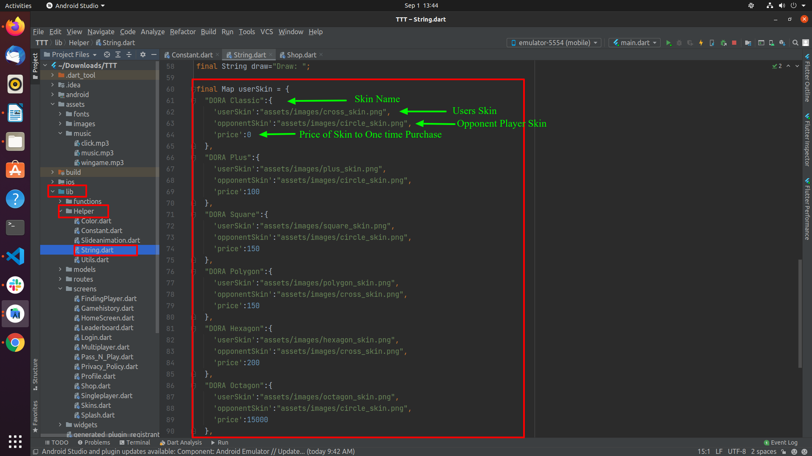
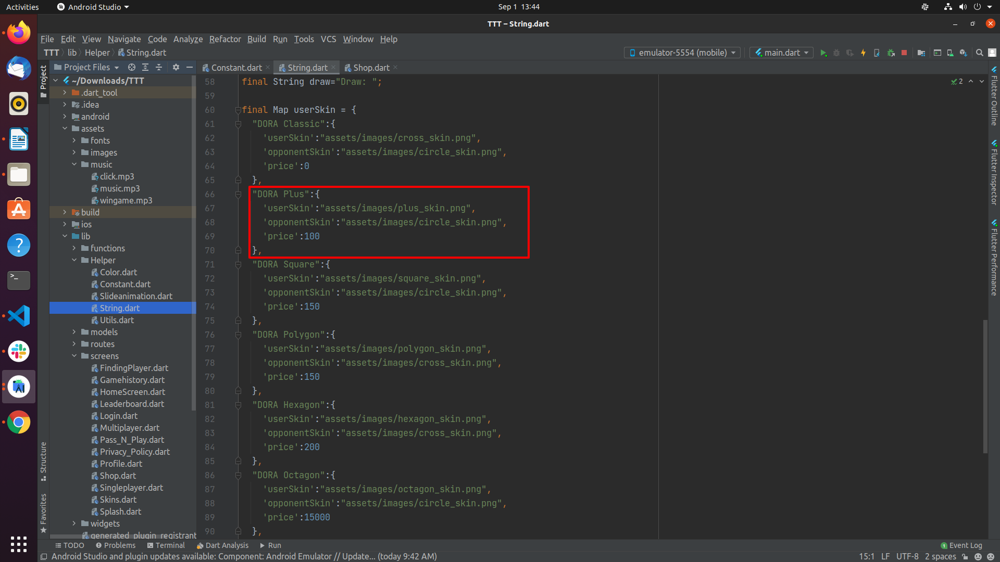

# How to change skins icon and price, or add more skins

1. To change skin icons and prices, or add more skins, go to `lib/Helper/String.dart` and edit the values shown below (do not change the variable names).

   

2. To add a new skin, create a block of code following the same pattern shown below. To remove a skin, delete its corresponding block.

   
