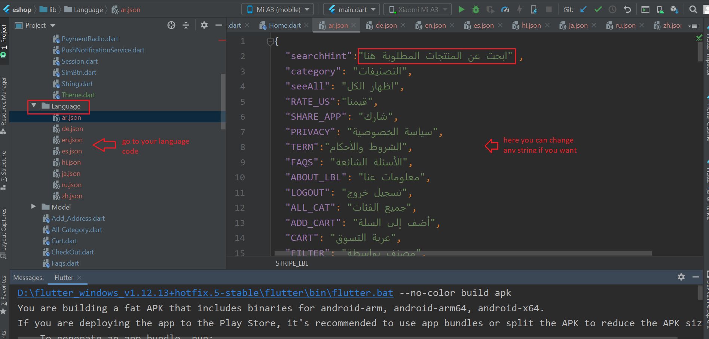
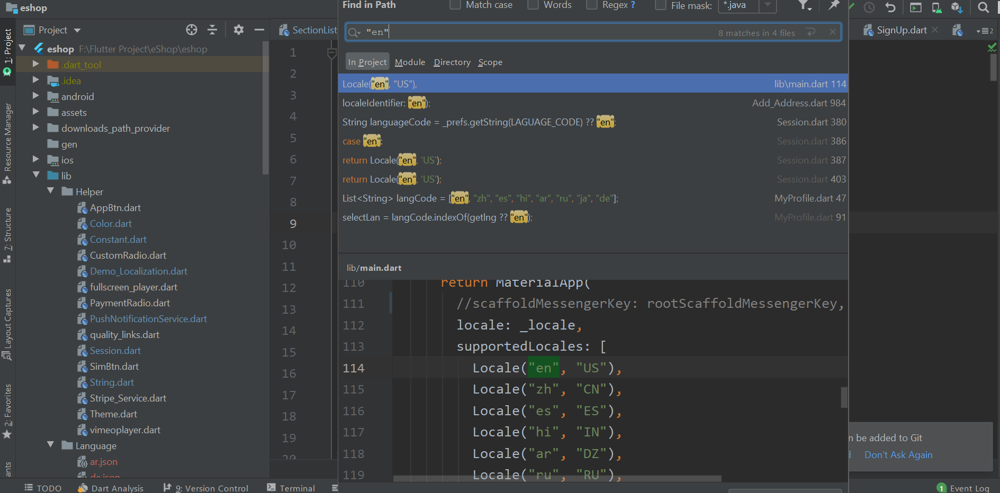
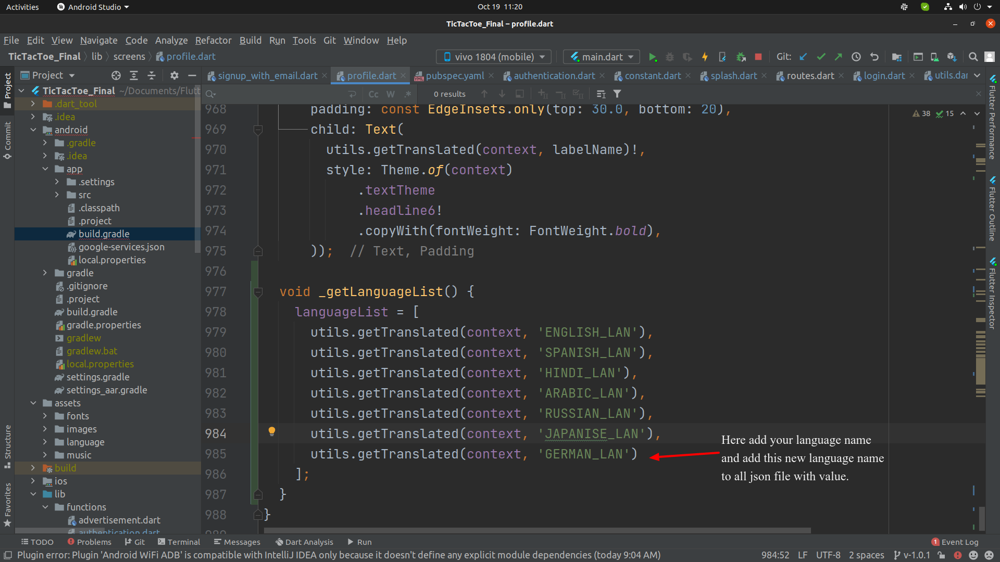
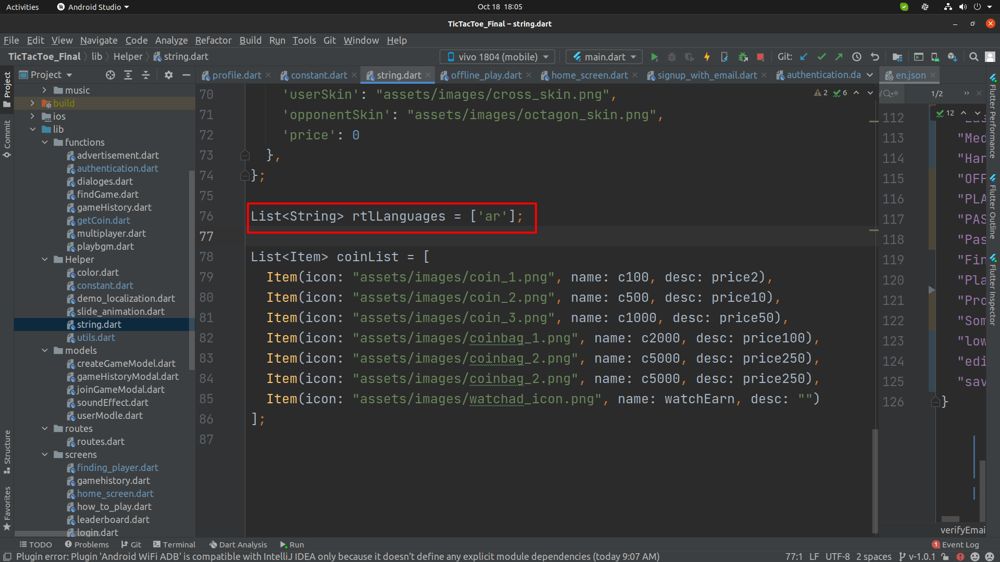

# How to add/remove a language

## To add a new language

1. Copy one JSON file from the language folder, add it back to the same folder, and rename it to your new language's code.
2. Open that JSON file and translate every string value into your new language. If any string is missing, the app will throw an error when that language is selected — make sure every JSON file has all the same keys.

   

3. Search the whole project for `"en"` (`Ctrl+Shift+F`). Wherever you see a list of language codes, add your new language code there too.

   

4. Open `profile.dart`, find the `_getLanguageList()` method, and add your new language's display name to `languageList` as shown below. Use the same key you used in the JSON files on the left, and the human-readable language name on the right.

   

5. If your new language needs RTL layout, add its code to the list at `lib/Helper/string.dart`:

   ```dart
   List<String> rtlLanguages = ['ar', 'ur'];
   ```

   

## To remove a language

Search the whole project for `"en"` (`Ctrl+Shift+F`). Wherever you see a list of language codes, remove the one you don't want.


