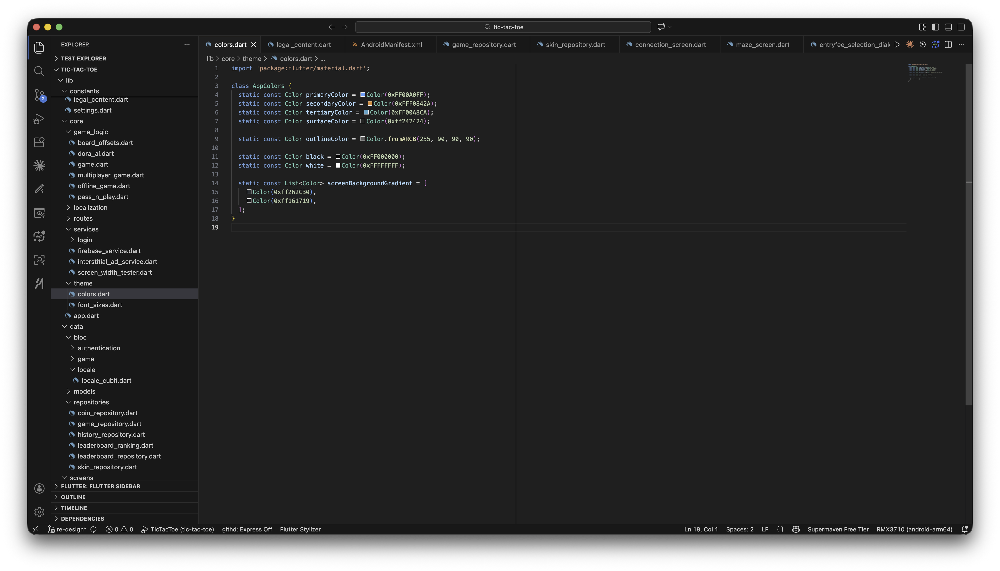

# How to Change Application Colors

App colors are defined in `lib/core/theme/colors.dart`:

```dart
class AppColors {
  static const Color primaryColor = Color(0xFF00A0FF);
  static const Color secondaryColor = Color(0xFFF0842A);
  static const Color tertiaryColor = Color(0xFF00A8CA);
  static const Color surfaceColor = Color(0xff242424);

  static const Color outlineColor = Color.fromARGB(255, 90, 90, 90);

  static const Color black = Color(0xFF000000);
  static const Color white = Color(0xFFFFFFFF);

  static const List<Color> screenBackgroundGradient = [
    Color(0xff262C30),
    Color(0xff161719),
  ];
}
```



Change the values, not the variable/field names — every screen references these constants by name (`AppColors.primaryColor`, etc.), so renaming a field means updating every call site too.

