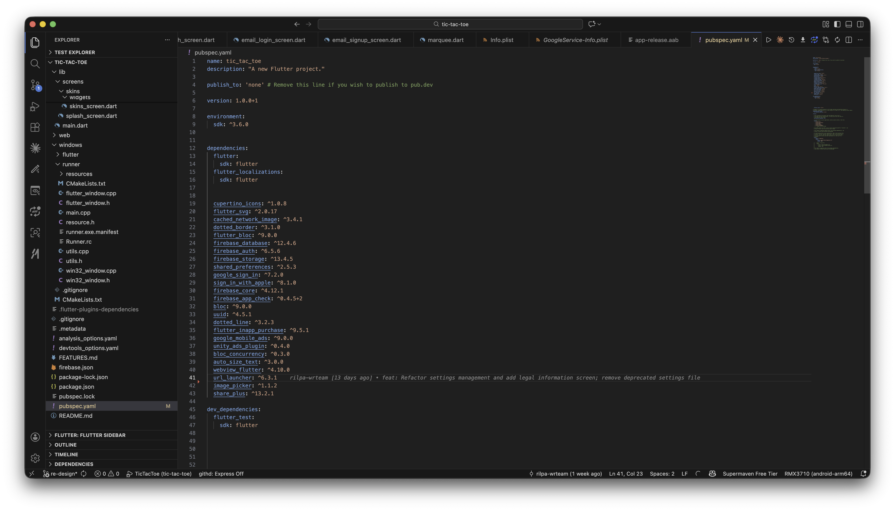
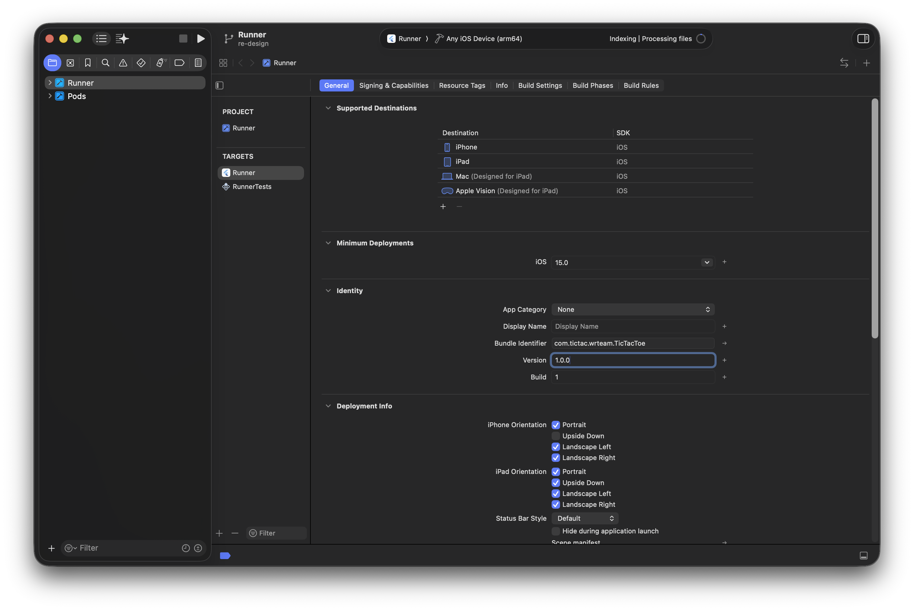
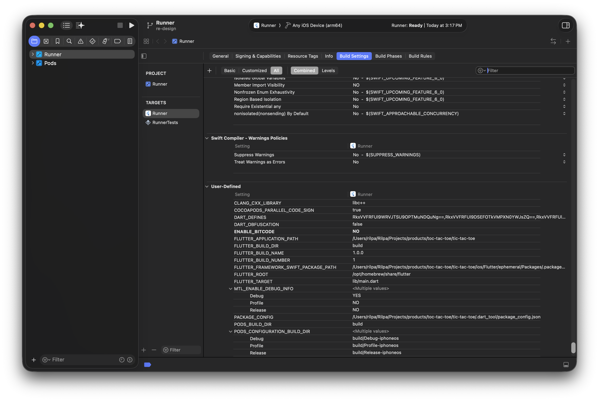

# How to Change App Version

Updating the app version in Flutter is an essential step before releasing your app. Follow these simple steps to modify the version for both Android and iOS.

## 🛠 Updating App Version in Flutter

### Step 1: Modify pubspec.yaml

Open the file named `pubspec.yaml`.

Locate the `version` field and update it in the following format:

```yaml
version: A.B.C+X
```

- `A.B.C` → Represents the version name (e.g., `1.0.0`).
- `X` → Represents the version code (e.g., `1`, `2`, `3`, etc.).



After making the changes, run the following command to apply them:

```bash
flutter pub get
```

## Updating App Version for iOS

### Step 1: Update Version in Xcode

1. Open your iOS project in Xcode.
2. Select **Runner** from the targets.
3. Navigate to **General**.
4. Locate the **Version** and **Build** fields:
   - **Version** (e.g., `1.0.0`).
   - **Build** (e.g., `1`, `2`, `3`, etc.).



### Step 2: Update FLUTTER_BUILD_NAME and FLUTTER_BUILD_NUMBER

1. In Xcode, select **Runner** from the targets.
2. Go to **Build Settings**.
3. Locate and modify the following fields:
   - `FLUTTER_BUILD_NAME` → Represents the version name (e.g., `1.0.0`).
   - `FLUTTER_BUILD_NUMBER` → Represents the version code (e.g., `1`, `2`, `3`, etc.).



You're all set! Now your app version is updated for both Android and iOS. 🚀
