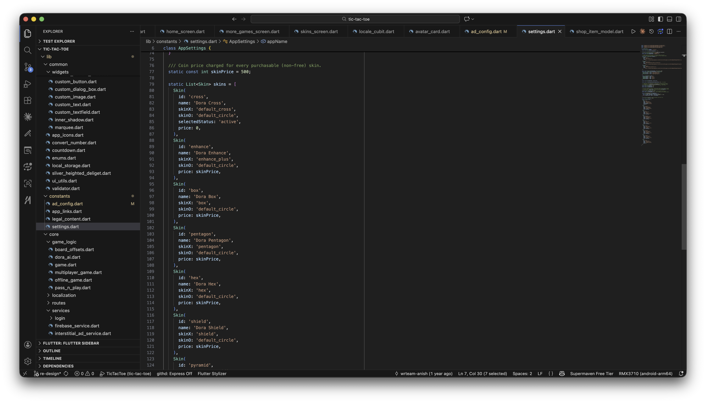

# How to Change Application Constants

Most tunable app-wide values live in `lib/constants/settings.dart`, in the `AppSettings` class.



## Board sizes

```dart
static final List<MatrixSize> matrixSizes = <MatrixSize>[
  MatrixSize(size: 3, title: 'Classic Mode (3x3)'),
  MatrixSize(size: 4, title: 'Advanced Mode (4x4)'),
  MatrixSize(size: 5, title: 'Expert Mode (5x5)'),
];
```

## Rounds per match

```dart
static List<GameRound> rounds = [
  GameRound(digit: 1, name: 'One'),
  GameRound(digit: 3, name: 'Three'),
  GameRound(digit: 5, name: 'Five'),
  GameRound(digit: 7, name: 'Seven'),
];
```

## Multiplayer coin entry fees

```dart
static const List<int> multiplayerFees = [10, 25, 50, 100];
```

## Per-turn timer

The countdown isn't a single fixed constant — it scales with board size via `turnDurationFor()`:

```dart
/// 3x3 -> 20s, 4x4 -> 30s, 5x5 -> 40s.
static const int _baseTurnTime = 20; // for the smallest (3x3) board
static const int _turnTimeStep = 10; // extra seconds per size beyond classic

static int turnDurationFor(int boardSize) {
  final int classicSize = matrixSizes.first.size; // 3
  final int steps = (boardSize - classicSize).clamp(0, 1 << 30);
  return _baseTurnTime + steps * _turnTimeStep;
}
```

Adjust `_baseTurnTime` and `_turnTimeStep` to change the timer for every board size at once.

## Matchmaking search timeout

```dart
static const int multiplayerConnectionSearchTime = 60; // in seconds
```

## Default skin, app name, support contact

```dart
static const String appName = 'TicTacToe';
static const String defaultLanguageCode = 'en';
static const String supportPhone = '9876543210';
static const String supportEmail = 'abc@gmail.com';
static final Skin defaultSkin = skins.first;
```

`supportPhone` / `supportEmail` are shown on the in-app Contact Us screen.

## Other topics with their own dedicated pages

- Leaderboard score values — see [Leaderboard Score](leaderboard-score.md).
- Skins list and pricing — see [Skins](skins.md).
- Coin shop packs — see [Coin Purchase](coin-purchase.md).
- Bonus mini games (Hextris, Clumsy Bird, Pacman) — `AppSettings.moreGames`, same file.
- Background music / sound effects — see [Change Music](change-music.md).

## Privacy Policy / Terms & Conditions / About / Contact copy

This app's legal and info pages are static in-app text, not external URLs — edit them in `lib/constants/legal_content.dart`. Play Store / App Store listing URLs (used for "Rate Us" / share) are in `lib/constants/app_links.dart`.
