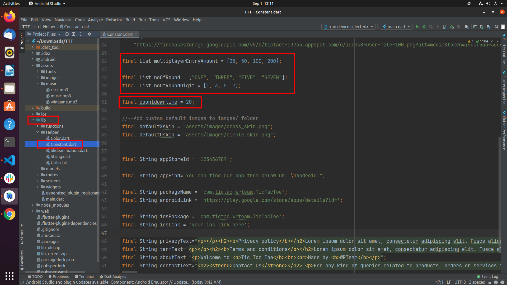
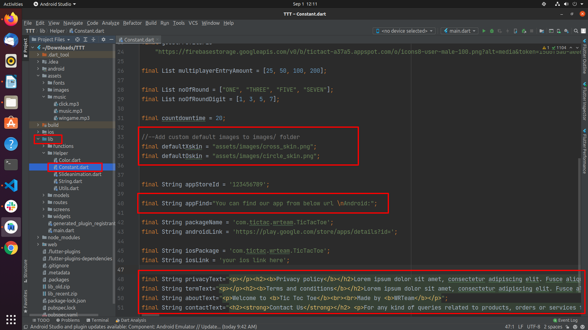

# How to change application constants

1. To change the player timer duration, the number of rounds, or round values, go to `lib/Helper/Constants.dart` and update the values shown below.

   

2. To change the default skin or other constants such as Privacy Policy / Terms and Conditions URLs, go to `lib/Helper/Constants.dart` and update the values shown below.

   
