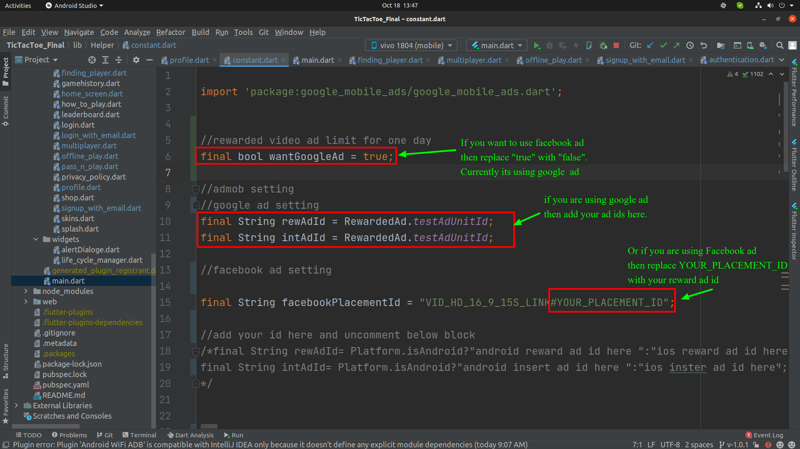
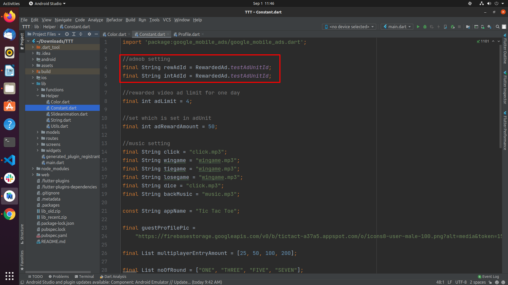
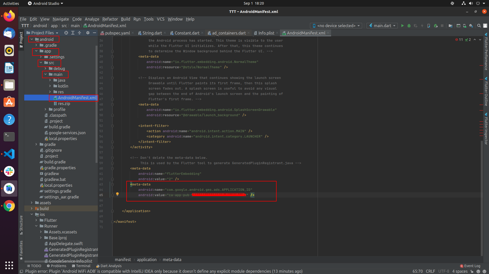
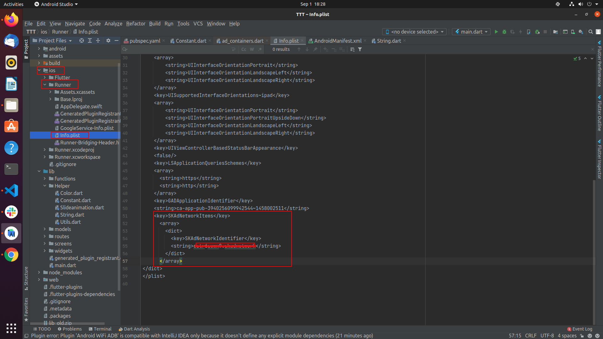
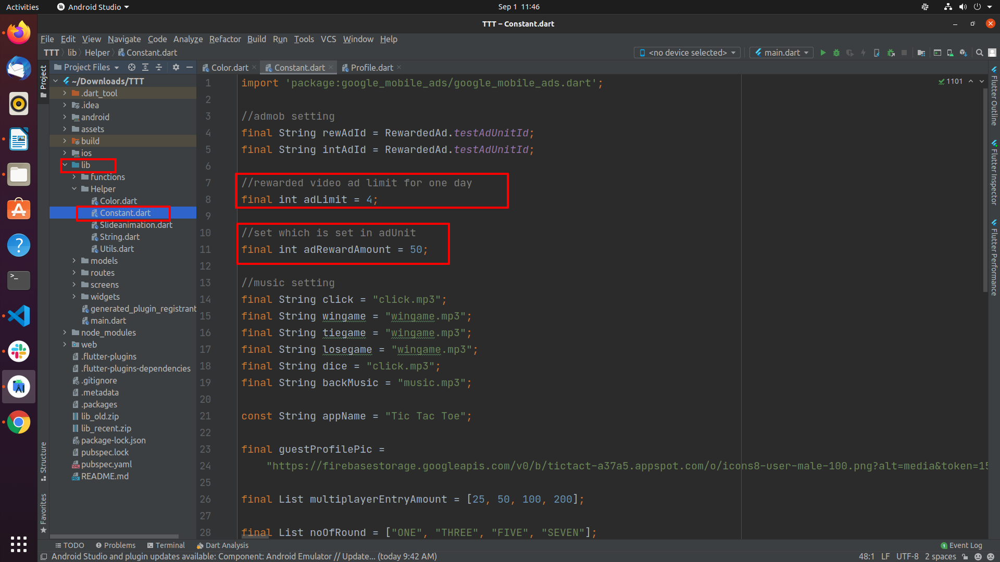

# How to Change Ad Type and Ad IDs

1. Select your ad type first.

   

2. If you're using Google ads, follow the steps below (otherwise skip them):

   1. Go to `lib/Helper/Constants.dart` and update the ad IDs as shown below.

      

   2. For Android, go to `android/app/src/main/AndroidManifest.xml` and update the ad IDs as shown below.

      

   3. For iOS, go to `ios/Runner/Info.plist` and update the ad IDs as shown below.

      

   For more info, see the [google_mobile_ads platform setup guide](https://pub.dev/packages/google_mobile_ads#platform-specific-setup).

   4. To change the daily reward ad limit and reward price, go to `lib/Helper/Constants.dart` and update the values shown below. Do not change the variable names.

      
