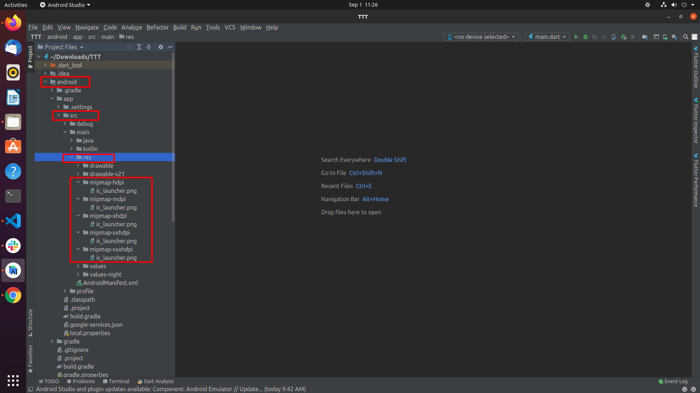
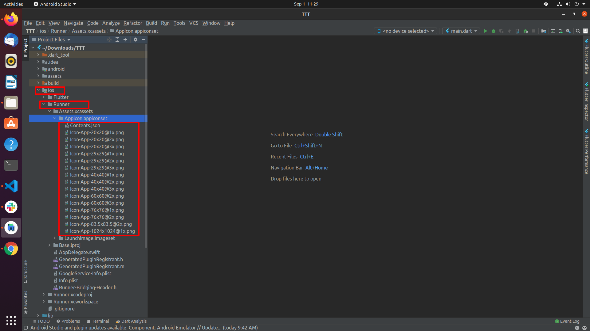

# How to change the application logo

## Android

Open `android/app/src/main/res/mipmap*` and add your logo for each device screen size (`mdpi`, `hdpi`, `xhdpi`, `xxhdpi`, `xxxhdpi`).

## iOS

Open `ios/Runner/Assets.xcassets/AppIcon.appiconset` and add your logo at each required size.

