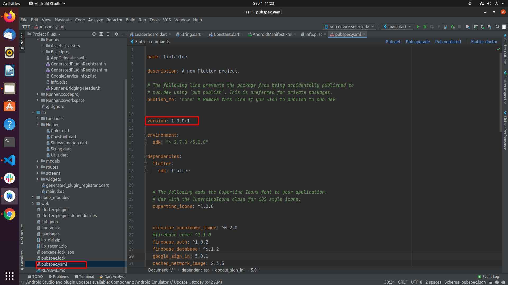

# How to change the application version

1. Go to `pubspec.yaml` and update `version: A.B.C+X`.
2. Don't forget to run `flutter packages get`, then `flutter build` or `flutter run` after this step.

