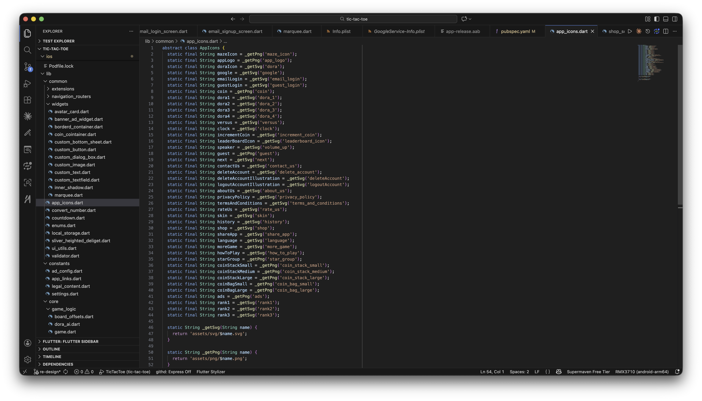
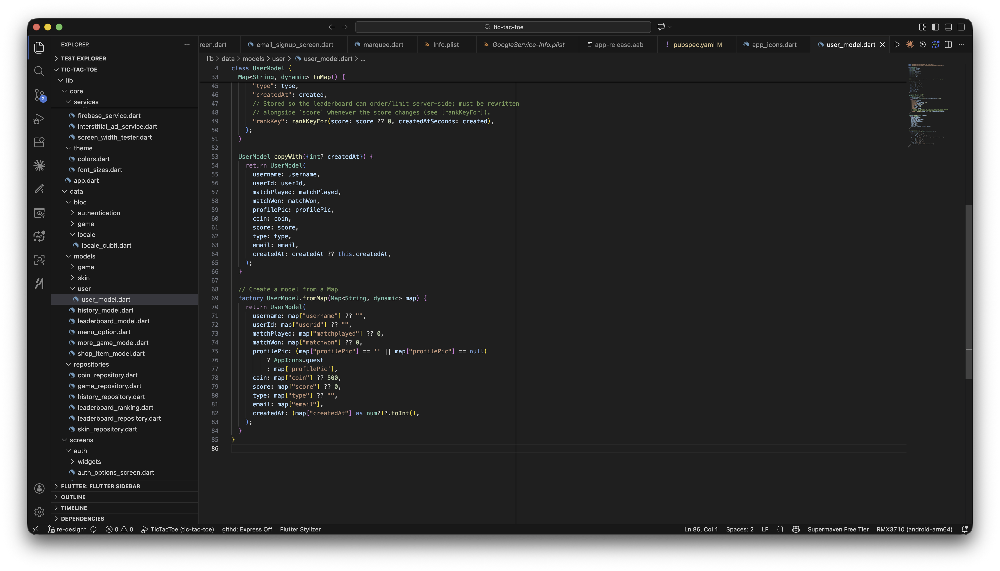

# How to Change the Guest Profile Icon

The guest/default profile picture is defined once in `lib/common/app_icons.dart`:

```dart
abstract class AppIcons {
  // ...
  static final String guest = _getPng('guest');
  // ...
}
```



It's used as the fallback whenever a user has no `profilePic` set, in `lib/data/models/user/user_model.dart`:

```dart
profilePic: (map["profilePic"] == '' || map["profilePic"] == null)
    ? AppIcons.guest
    : map['profilePic'],
```



To change it, replace `assets/png/guest.png` with your own image (keep the same filename), or point `AppIcons.guest` at a different asset.

