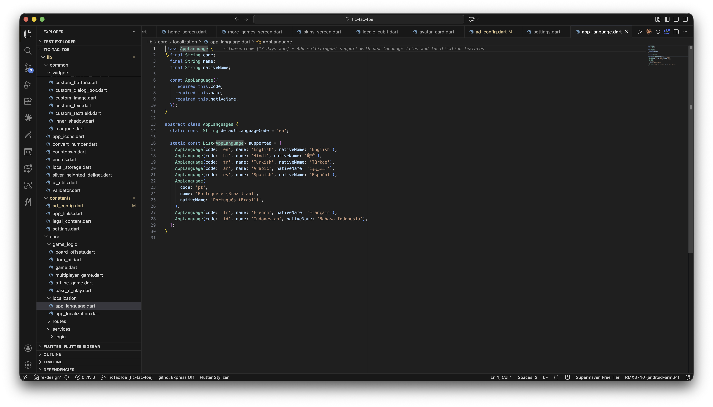

# How to Add/Remove a Language

The list of supported languages is centralized in `lib/core/localization/app_language.dart`:

```dart
abstract class AppLanguages {
  static const String defaultLanguageCode = 'en';

  static const List<AppLanguage> supported = [
    AppLanguage(code: 'en', name: 'English', nativeName: 'English'),
    AppLanguage(code: 'hi', name: 'Hindi', nativeName: 'हिन्दी'),
    AppLanguage(code: 'tr', name: 'Turkish', nativeName: 'Türkçe'),
    AppLanguage(code: 'ar', name: 'Arabic', nativeName: 'العربية'),
    AppLanguage(code: 'es', name: 'Spanish', nativeName: 'Español'),
    AppLanguage(code: 'pt', name: 'Portuguese (Brazilian)', nativeName: 'Português (Brasil)'),
    AppLanguage(code: 'fr', name: 'French', nativeName: 'Français'),
    AppLanguage(code: 'id', name: 'Indonesian', nativeName: 'Bahasa Indonesia'),
  ];
}
```



## To add a new language

1. Copy `assets/languages/en.json` to a new file named after your language code (e.g. `de.json`), and translate every value. If any key is missing, that string falls back silently rather than throwing — but keep every JSON file's keys in sync to avoid missing translations.
2. Add a new `AppLanguage(code: ..., name: ..., nativeName: ...)` entry to `AppLanguages.supported` above, using the same code as your JSON filename.

That's it — no other file needs touching. RTL layout (e.g. for Arabic) is handled automatically by Flutter based on the language's `code`, not a separate list.

## To remove a language

Remove its `AppLanguage(...)` entry from `AppLanguages.supported`, and optionally delete the matching JSON file from `assets/languages/`.

<!-- TODO: add screenshot — language-selector.png (language selection screen in the app) -->
