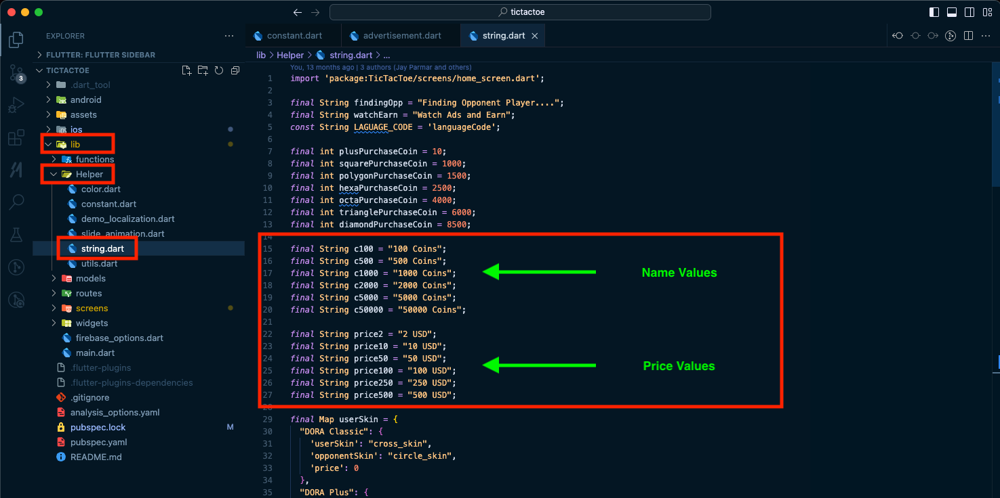
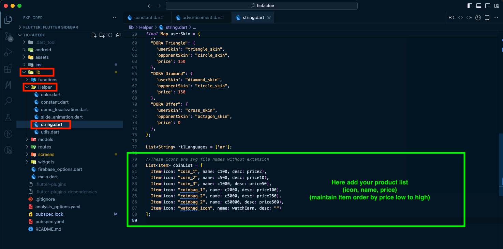
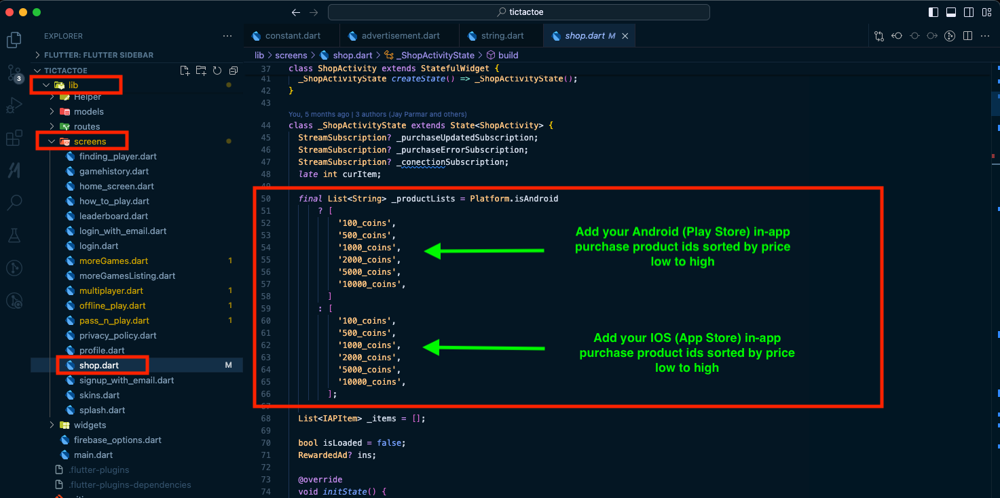

# How to Change Coin Purchase Values / Add More Coins to Purchase

1. To change the icon/image, price, and name of coin items, edit `lib/Helper/String.dart` as shown below (do not change the variable names).

   
   

2. To add your own coin items with in-app purchases, add or modify existing items in `lib/screens/Shop.dart` as shown below.

   > Note: the app uses the price and name returned by the store first — if that's not found, it falls back to the app-side values.

   
