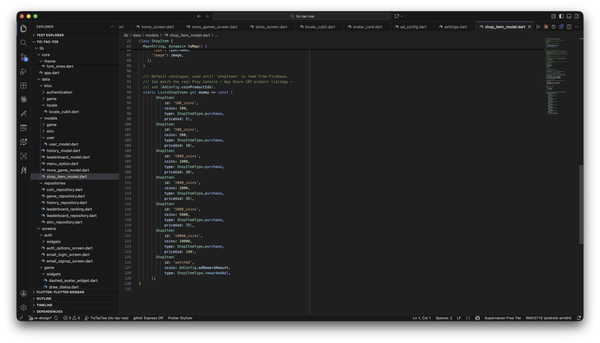
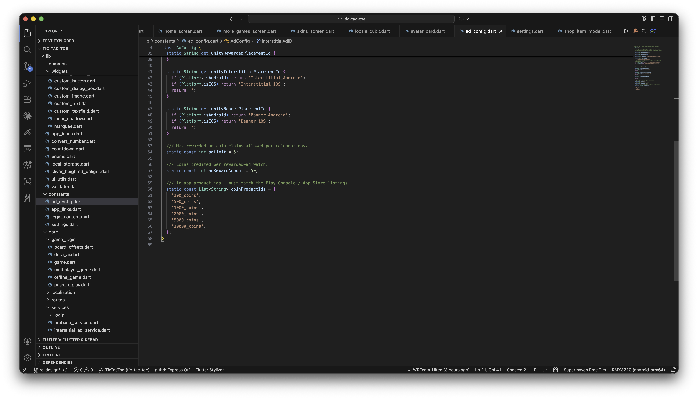

# How to Change Coin Purchase Values / Add More Coins to Purchase

The Shop's coin packs are defined in `ShopItem.dummy`, in `lib/data/models/shop_item_model.dart`:

```dart
/// Default catalogue, used until `shopItems` is read from Firebase.
/// Ids match the real Play Console / App Store IAP product listings —
/// see [AdConfig.coinProductIds].
static List<ShopItem> get dummy => const [
      ShopItem(id: '100_coins', coins: 100, type: ShopItemType.purchase, priceUsd: 2),
      ShopItem(id: '500_coins', coins: 500, type: ShopItemType.purchase, priceUsd: 10),
      ShopItem(id: '1000_coins', coins: 1000, type: ShopItemType.purchase, priceUsd: 20),
      ShopItem(id: '2000_coins', coins: 2000, type: ShopItemType.purchase, priceUsd: 35),
      ShopItem(id: '5000_coins', coins: 5000, type: ShopItemType.purchase, priceUsd: 75),
      ShopItem(id: '10000_coins', coins: 10000, type: ShopItemType.purchase, priceUsd: 140),
      ShopItem(id: 'watchAd', coins: AdConfig.adRewardAmount, type: ShopItemType.rewardedAd),
    ];
```



1. **Change coin amounts or fallback prices** — edit the `coins` / `priceUsd` values above. `priceUsd` is only a fallback shown until the real store price loads — the app prefers the live price from Google Play / App Store for each product ID via `flutter_inapp_purchase`.
2. **Add a new coin pack** — add another `ShopItem(...)` entry here, then create a matching in-app product with the same `id` in both the Play Console and App Store Connect.
3. **Keep product IDs in sync** — every purchasable `id` must also be listed in `coinProductIds` in `lib/constants/ad_config.dart`:

   ```dart
   static const List<String> coinProductIds = [
     '100_coins',
     '500_coins',
     '1000_coins',
     '2000_coins',
     '5000_coins',
     '10000_coins',
   ];
   ```

   

4. **Coin artwork** — packs use tiered artwork automatically based on `coins` (small/medium/large stacks, then bags for the heaviest packs) via `ShopItem.coinArtwork`, unless you pass an explicit `image` to the item.

