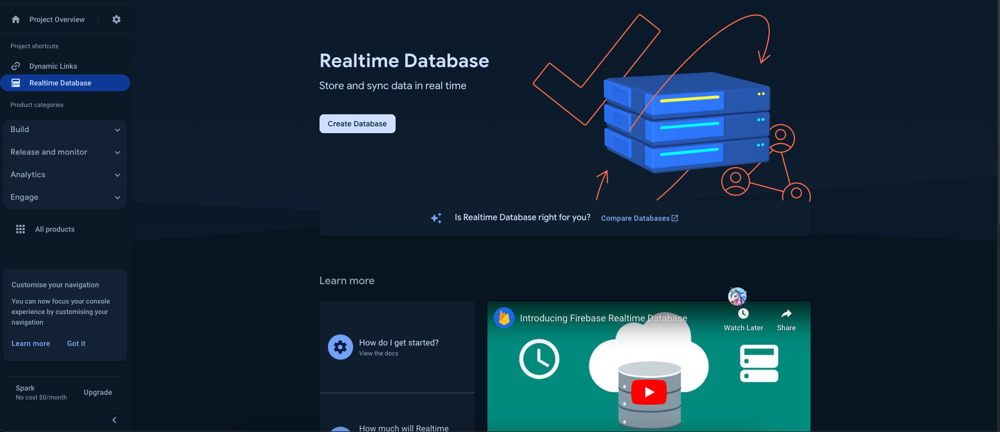
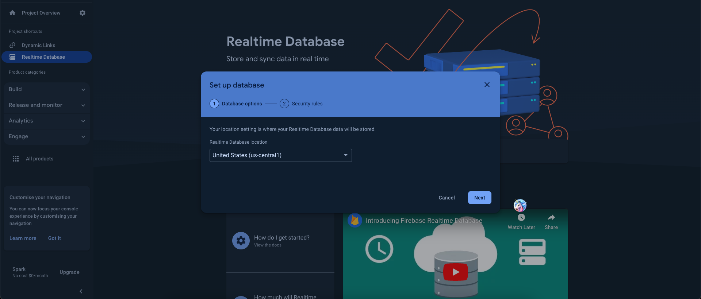
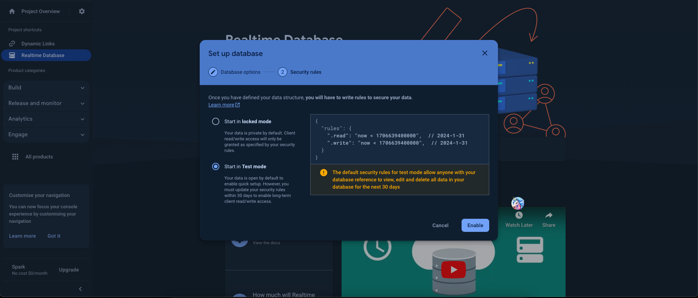

# How to enable the Firebase Database

This app uses the **Realtime Database** to sync live game data (moves, turns, room state) between players with minimal latency.

1. Open your Firebase project → **Build → Realtime Database → Create Database**.
2. Choose a database location, then choose a starting mode for your security rules (**test mode** for development, **locked mode** for production — you can edit the rules any time afterwards). A database is created automatically and this is where your game data will be stored.

   
   
   

> **Note:** Firebase now recommends **Cloud Firestore** as the default database for new projects in general. This app specifically relies on Realtime Database for its low-latency multiplayer sync, so keep using Realtime Database unless you're intentionally migrating the game-sync logic to Firestore.

3. Before going to production, review your rules under the **Rules** tab and lock them down beyond the defaults (avoid leaving `read`/`write` open to everyone).
