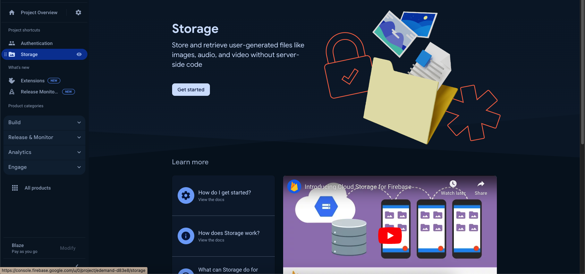
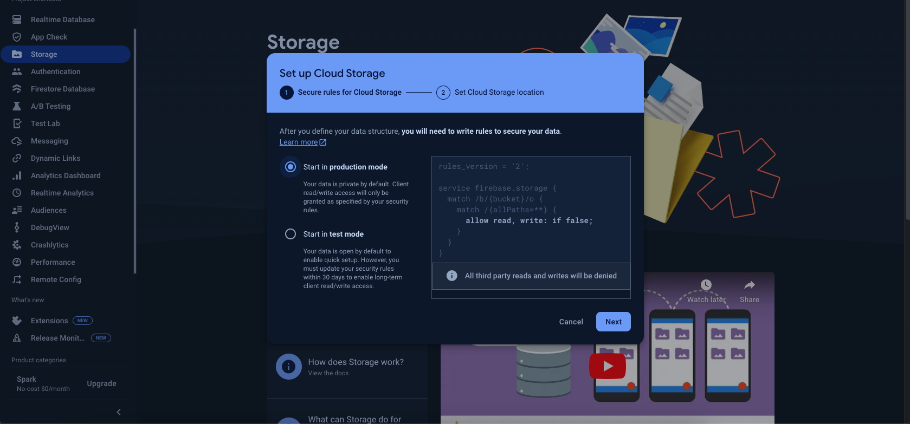
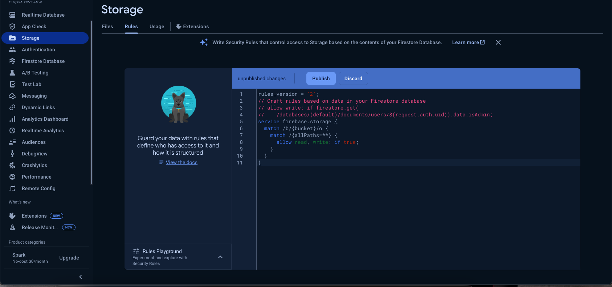

# How to Enable Firebase Storage

1. Open your Firebase project → **Build → Storage → Get started**, and press **Next** through the setup dialog. A storage bucket is created automatically — this is where user profile images will be stored.

   
   

2. Go to the **Rules** tab and set the rules below:

   ```
   rules_version = '2';
   // Craft rules based on data in your Firestore database
   // allow write: if firestore.get(
   //    /databases/(default)/documents/users/$(request.auth.uid)).data.isAdmin;
   service firebase.storage {
     match /b/{bucket}/o {
       match /{allPaths=**} {
         allow read, write: if true;
       }
     }
   }
   ```

   

> **Note:** `allow read, write: if true;` is open to anyone and is meant to get you started quickly. Before shipping to production, restrict this — for example scope writes to `request.auth != null` (signed-in users only) or to the authenticated user's own folder.
