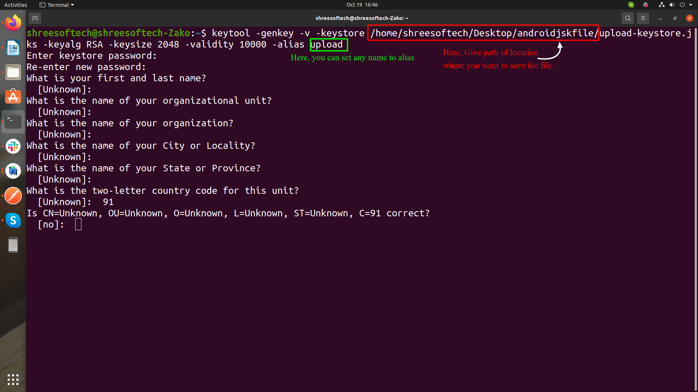
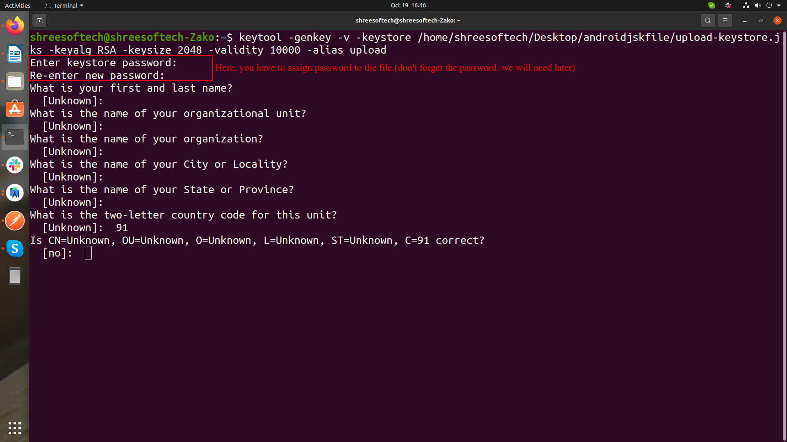
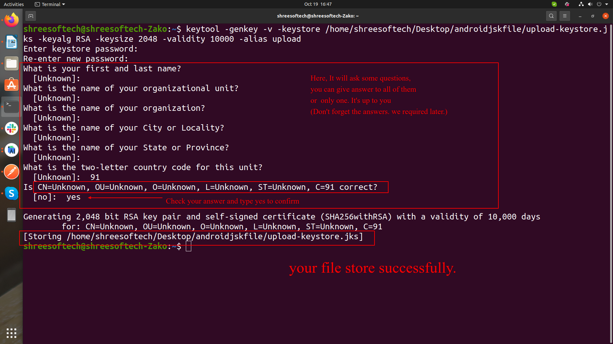
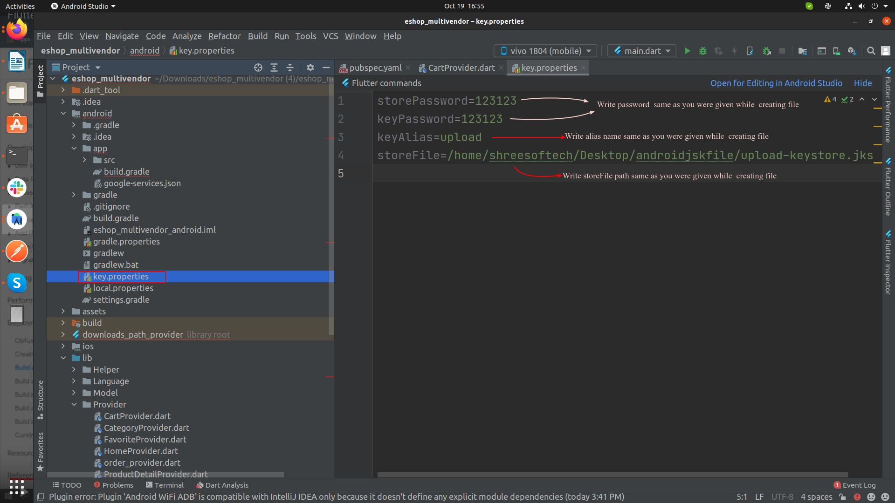
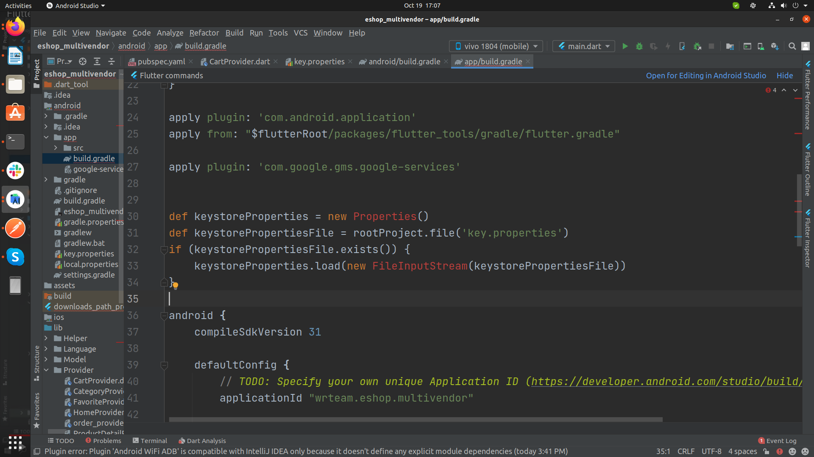
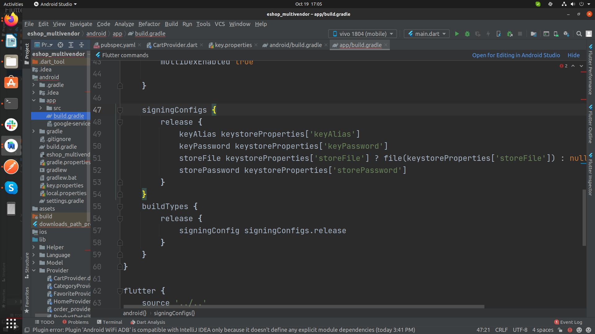
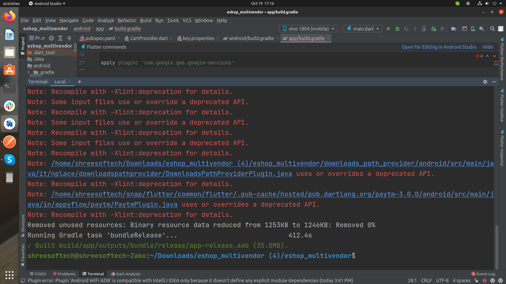

# How to Generate a Release APK / App Bundle

## 1. Create an upload keystore

Run one of the following:

**Mac/Linux:**
```bash
keytool -genkey -v -keystore ~/upload-keystore.jks -keyalg RSA -keysize 2048 -validity 10000 -alias upload
```

**Windows:**
```bash
keytool -genkey -v -keystore c:\Users\USER_NAME\upload-keystore.jks -storetype JKS -keyalg RSA -keysize 2048 -validity 10000 -alias upload
```





## 2. Reference the keystore from the app

Create a file named `[project]/android/key.properties` with a reference to your keystore.


Paste this into `key.properties` and fill in your own values:

```properties
storePassword=<password from previous step>
keyPassword=<password from previous step>
keyAlias=upload
storeFile=<location of the keystore file, e.g. /Users/username/upload-keystore.jks>
```



## 3. Configure signing in Gradle

Edit `[project]/android/app/build.gradle`:

1. Add this before the `android` block:

   ```groovy
   def keystoreProperties = new Properties()
   def keystorePropertiesFile = rootProject.file('key.properties')
   if (keystorePropertiesFile.exists()) {
       keystoreProperties.load(new FileInputStream(keystorePropertiesFile))
   }
   ```

   

2. Find the `buildTypes` block and add a matching `signingConfigs` block:

   ```groovy
   signingConfigs {
       release {
           keyAlias keystoreProperties['keyAlias']
           keyPassword keystoreProperties['keyPassword']
           storeFile keystoreProperties['storeFile'] ? file(keystoreProperties['storeFile']) : null
           storePassword keystoreProperties['storePassword']
       }
   }
   buildTypes {
       release {
           signingConfig signingConfigs.release
       }
   }
   ```

   

## 4. Build

```bash
# APK
flutter build apk

# App Bundle
flutter build appbundle
```


