# How to integrate Firebase

The recommended way to connect a Flutter app to Firebase today is the **FlutterFire CLI**, not manually downloading and placing config files. It registers your Android/iOS apps and generates a single typed config file for you. The manual method still works and is documented below as a fallback.

## 1. Create a Firebase project

1. Go to the [Firebase Console](https://console.firebase.google.com/) and click **Add project**.

   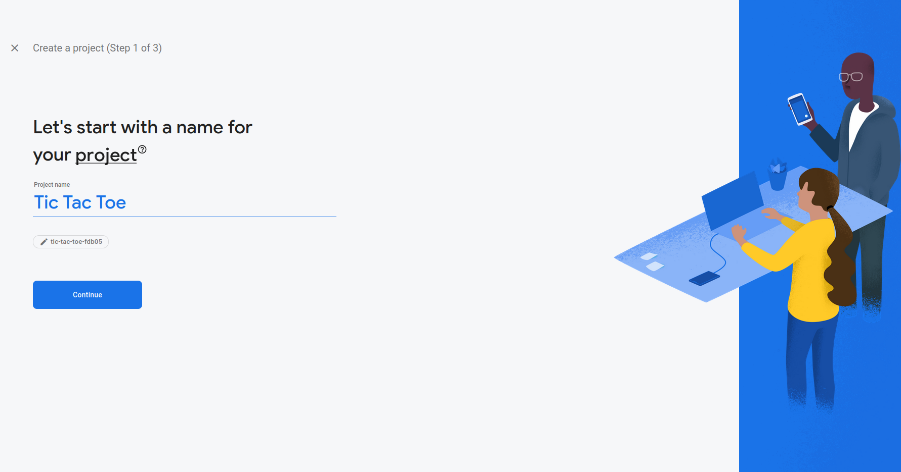
   
   
   

2. Google Analytics is optional during project creation — enable or skip it, it doesn't affect the steps below.

## 2. Configure the app with the FlutterFire CLI (recommended)

1. Install the Firebase CLI if you don't already have it, and log in:

   ```bash
   npm install -g firebase-tools
   firebase login
   ```

2. Install the FlutterFire CLI:

   ```bash
   dart pub global activate flutterfire_cli
   ```

3. From your Flutter project root, run:

   ```bash
   flutterfire configure
   ```

   Select your Firebase project, then select the platforms you want to support (Android / iOS). This will:
   - Register the Android and iOS apps in your Firebase project automatically (equivalent to the manual "Add app" steps below).
   - Download `google-services.json` into `android/app/` and `GoogleService-Info.plist` into `ios/Runner/` for you.
   - Generate `lib/firebase_options.dart` with a typed `DefaultFirebaseOptions` class.

4. Add the Firebase packages you need, at minimum `firebase_core`:

   ```bash
   flutter pub add firebase_core
   ```

5. Initialize Firebase in `lib/main.dart` **before** `runApp()`:

   ```dart
   import 'package:firebase_core/firebase_core.dart';
   import 'firebase_options.dart';

   void main() async {
     WidgetsFlutterBinding.ensureInitialized();
     await Firebase.initializeApp(
       options: DefaultFirebaseOptions.currentPlatform,
     );
     runApp(const MyApp());
   }
   ```

6. For Android, if you use Google Sign-In, Phone Auth, or Dynamic Links, add your SHA-1 (and SHA-256) fingerprint to the Firebase project. You can get it from your project root:

   ```bash
   cd android && ./gradlew signingReport
   ```

   Then add it under **Project settings → Your apps → Android app → Add fingerprint** in the Firebase console. See the [official guide](https://developers.google.com/android/guides/client-auth) for details on obtaining SHA keys.

7. For iOS, open `ios/Runner.xcworkspace` in Xcode and confirm `GoogleService-Info.plist` is listed under the `Runner` target (FlutterFire CLI adds it for you). Run `pod install` inside the `ios` folder if needed.

That's it — both platforms are now connected to Firebase.

## 3. Manual method (fallback)

If you prefer to register the apps by hand instead of using the CLI:

1. **Add an Android app** to your Firebase project (Project settings → Your apps → Add app → Android), enter your package name, and register.

   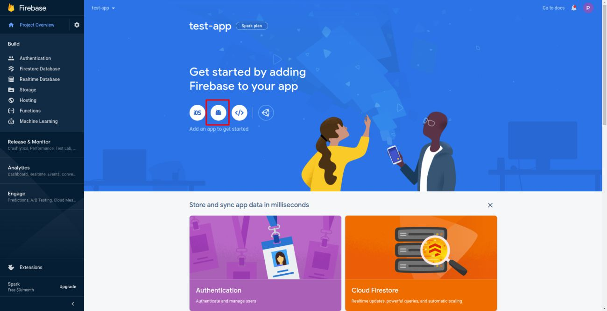

2. Add your SHA-1 key — see [this guide](https://developers.google.com/android/guides/client-auth) on how to get it.

   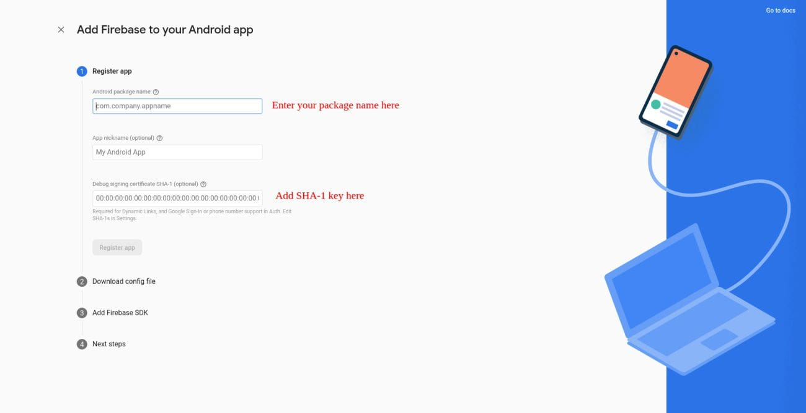
   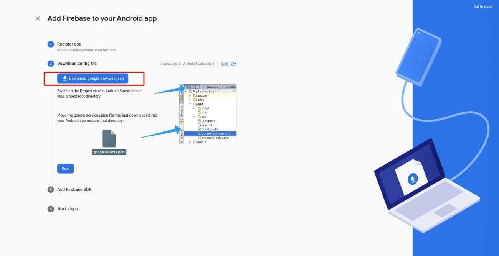
   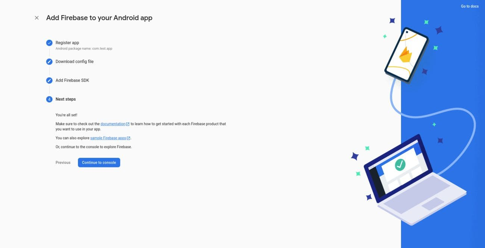

3. Download `google-services.json` and place it in `android/app/`.

4. **Add an iOS app** to your Firebase project (Project settings → Your apps → Add app → iOS).

   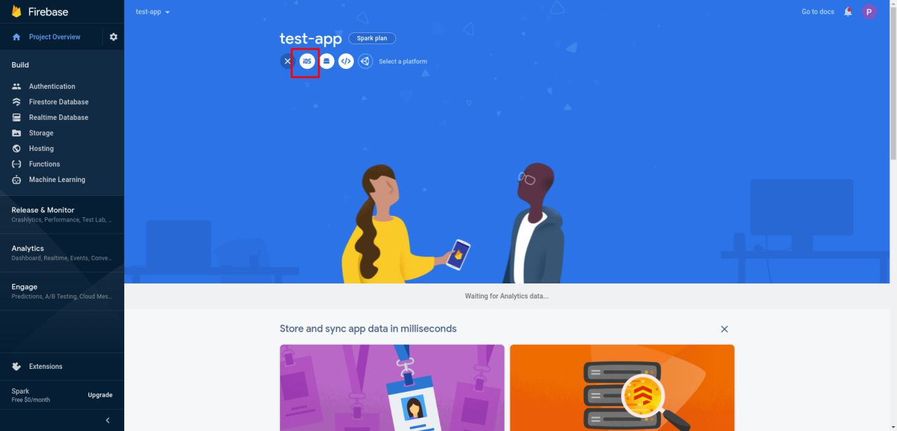

5. Get your bundle ID from `[your-flutter-project-dir]/ios/Runner.xcodeproj/project.pbxproj` (search for `PRODUCT_BUNDLE_IDENTIFIER`).

   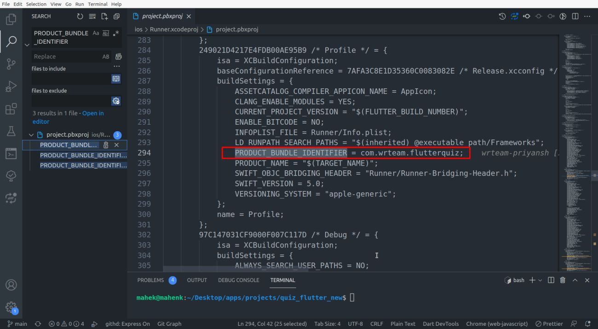
   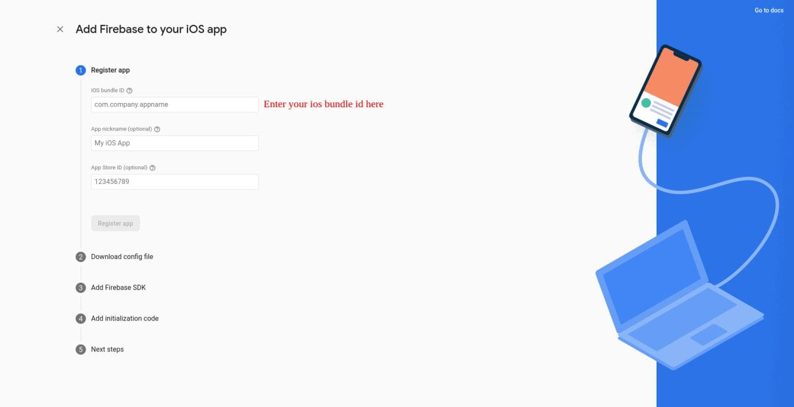
   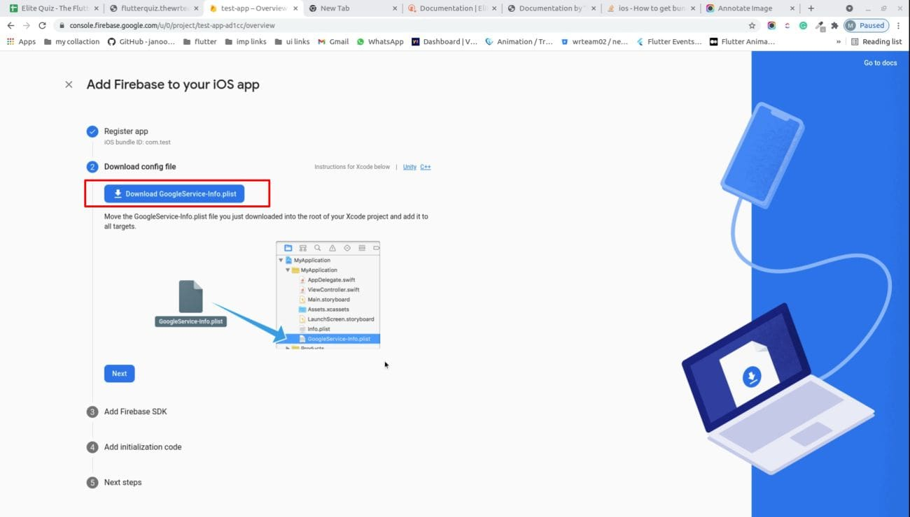
   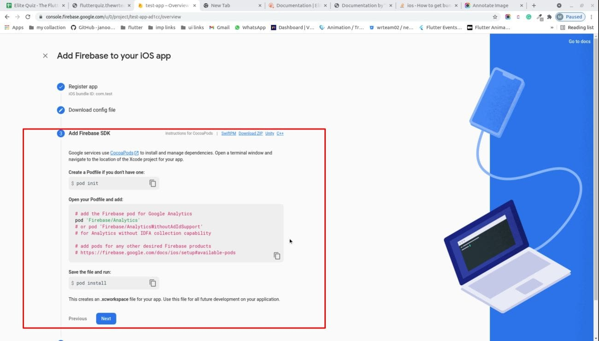
   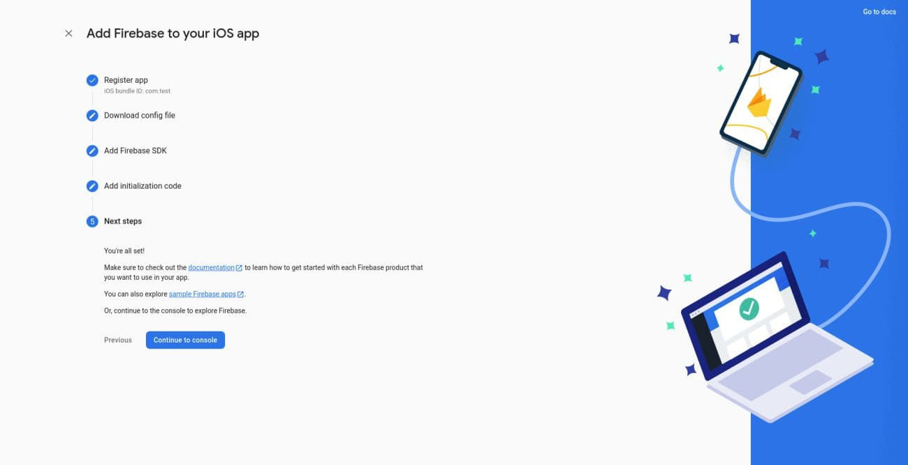

6. Download `GoogleService-Info.plist` and add it to `ios/Runner` via Xcode (drag it into the `Runner` group so it's included in the target).

With either method, your Android and iOS apps are now connected to your Firebase project. Continue to [Firebase Authentication](firebase-auth.md).
