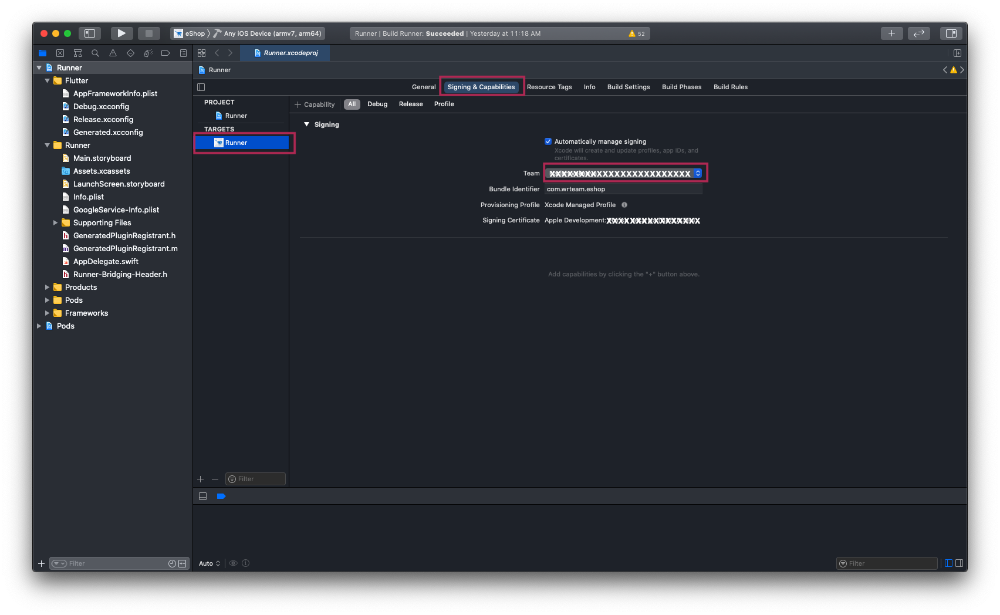
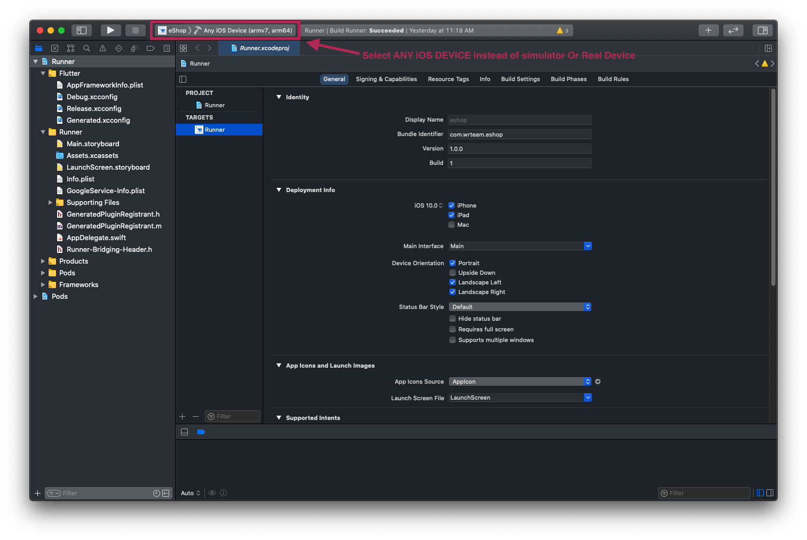
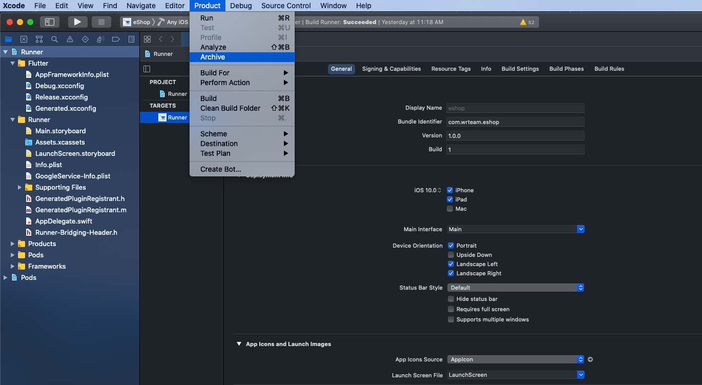
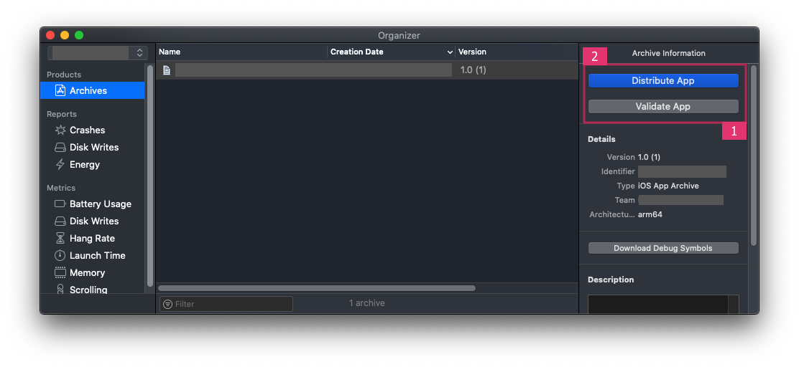

# Steps to publish the iOS app to the App Store

1. Open your project's `Runner.xcworkspace` in Xcode. Add your Team (your Apple Developer ID), and make sure `GoogleService-Info.plist` (downloaded from your Firebase project) is inside the `Runner` folder.

   

2. Select **Any iOS Device (arm64)** as the build target, as shown below.

   

3. From the **Product** menu, select **Archive**.

   

4. Once the archive is built, a window will pop up. Validate the app first, then, after successful validation, distribute it to the App Store.

   

5. After a successful upload, the build will appear in your Apple Developer account under the app with the matching Bundle ID.

For a more detailed walkthrough, see [this guide](https://codewithchris.com/submit-your-app-to-the-app-store/).
