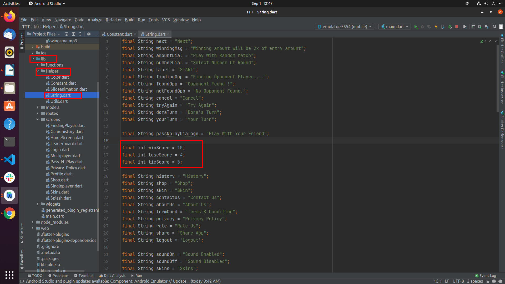

# How to change leaderboard score calculation values

Go to `lib/Helper/String.dart` and edit the values shown below (do not change the variable names):

- `winScore` — added to a user's total score when they win a round.
- `loseScore` — deducted from a user's total score when they lose a round.
- `tieScore` — added to both players' total score when a game ends in a tie.

