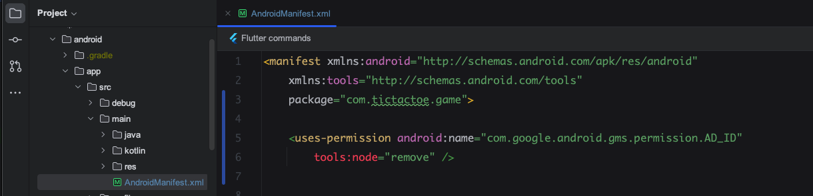

# How to remove ads

If you want to remove ads entirely, make the following changes:

1. Go to `android/app/src/main/AndroidManifest.xml`.
2. Add the below permission:

   ```xml
   <uses-permission android:name="com.google.android.gms.permission.AD_ID" tools:node="remove" />
   ```

3. Also make sure this namespace is declared on the `<manifest>` tag if it isn't already there:

   ```xml
   xmlns:tools="http://schemas.android.com/tools"
   ```

The file should look like this:


